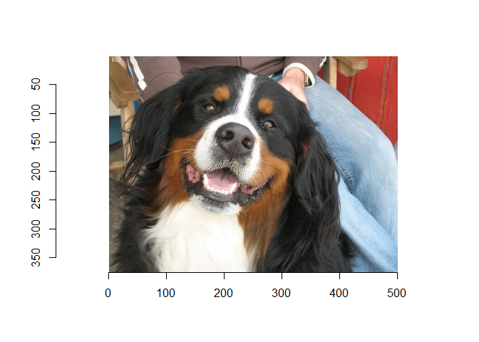

<!-- README.md is generated from README.Rmd. Please edit that file -->

# testPackage

<!-- badges: start -->
<!-- badges: end -->

The goal of testPackage is to learn R Package Dev

## Installation

Installation:

``` r
# install.packages("devtools")
devtools::install_github("kianwazzu/testPackage")
```

## Example

This is how you can see a dog

``` r
library(testPackage)
see_a_dog()
```


